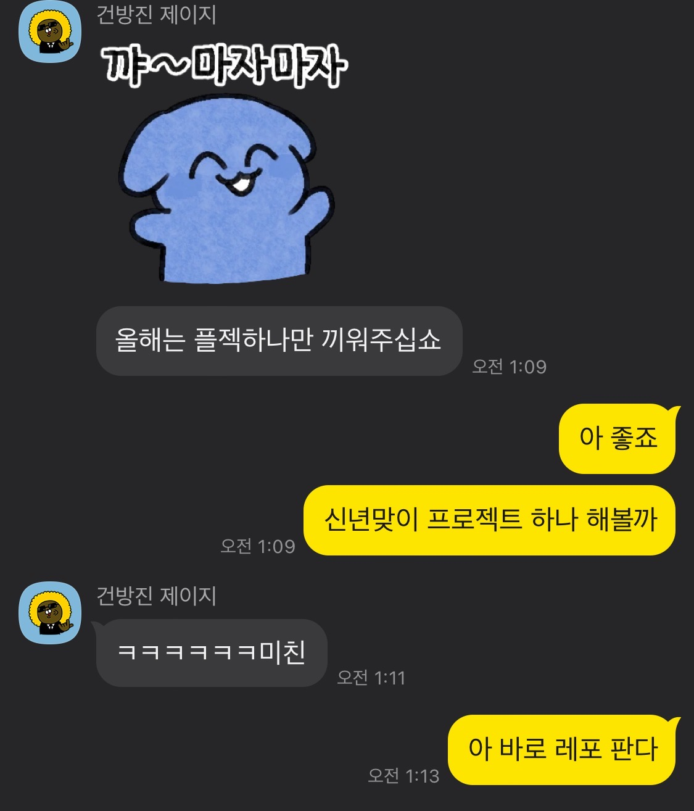

# 일단 레포부터 파고보자! 신년맞이 애자일 프로젝트

## 1월 1일 사건의 발단

2022년 1월 1일 새벽 1시, 한창 지인들과 새해 인사를 주고 받다가 자연스레(?) 사이드 프로젝트 얘기가 나왔다. 평소 이런 저런 사이드 프로젝트를 벌이고 다니는 나를 보고 지인이 "자신도 끼워달라"라고 한 것이다. 그 순간 가슴에서 팟 하고 불꽃이 피어올랐다. '아, 지금 당장 프로젝트를 해야겠다'. 나는 즉시 깃헙에 접속해서 `resolution-reminder`라는 이름의 레포지토리를 생성했다.

레포지토리를 생성하는 동안 내 머릿속에는 순식간에 기획안이 써내려져 갔다. 기본적인 레퍼런스는 산타파이브 팀의 colormytree 프로젝트와 여러 관광지에 있는 느린 우체통이였다. 대부분의 사람들이 연초에는 넘치는 의욕으로 여러 계획을 세우고는 하지만 설날정도만 되더라도 흐지부지되는 경우가 많다고 생각했다. 나 역시 그랬으니깐.

1월 1일에 사람들의 새해 다짐들을 모으고, 설날에 다시 떠올릴 수 있도록 메일을 보내는 서비스를 기획했다. 정말 간단하게 구현 가능한 설문지 형식의 웹 페이지를 30분 만에 만들고, firebase의 firestore를 이용해 데이터베이스를 붙인 다음 firebase의 hosting을 통해 배포까지 2시간이 채 걸리지 않았다.

디자인도 빠르게 html/css로 퍼블리싱할 수 있도록 최대한 간단한 컨셉의 디자인을 진행했다. 덕분에 figma에서 디자인하고 퍼블리싱하기까지 30분 정도가 걸렸다.

newyear1stday.com이라는 도메인을 구입하고, 해당 도메인에 웹 페이지를 연결한 다음, 페이스북을 통해 내 서비스를 홍보했다.

## 애자일의 시작은 배포 이후부터

제 1목표를 빠른 '서비스 런칭'에 두고 기획 및 개발을 진행했기 때문에 입력 값 유효성 검사라던지, 코드 퀄리티라던지 대부분을 신경쓰지 않고 빠르게 개발을 진행했다. 그 때문에 배포 직후 지인 개발자들로부터 많은 버그 리포트들을 받을 수 있었다. 아무 값을 입력하지 않아도 다음 화면으로 넘어가진다던지, 이메일에 `asdf`값은 값을 입력해도 오류를 내지 않는다던지 하는 크고 작은 버그들을 고치면서 반강제적으로 애자일 방법론을 적용하게 되었다.

## 내가 리마인더 타이밍을 설날로 잡은 이유

내가 기획한 서비스는 크게 두 단계로 나뉜다.
1. 새해 다짐을 입력하는 단계
2. 다짐을 메일로 리마인드 받는 단계

이 중에 1월 1일에 개발되었던건 오직 1단계 뿐이였다. 즉, 새해 다짐을 입력 받을 수만 있고 다시 리마인드 받을 수 있는 방법은 존재하지 않았다.

그래서 기획 단계부터 1월 1일 시점에는 입력만 받으면 되니 입력만 빠르게 개발해두고, 좀 여유를 가지고 리마인드가 필요해지는 시점에 가서 리마인더를 개발하자는 생각으로 서비스의 개발 단계를 나누어 진행하기로 했다. 만약 2단계를 개발하지 못한다면 모든 사람들에게 내가 직접 메일을 손으로 일일이 타이핑 해서 보내는 방법도 있으니 나름 플랜 B도 있었다.

그런데 설날이 생각보다 빨리 찾아왔다. 나는 기껏 빨라봐야 2월 중순 아니면 2월 말에 설날일 줄 알았는데, 2월 1일이 설날이라니. 내 예상보다 프로젝트 일정이 빡빡하게 잡히는 꼴이 되었다. 그리고 난 2월 1일이 설날이란 걸 1월 20일에 알았다. 손으로 메일을 일일이 보내게 생겼다.

## 두번째 페이즈 시작 with Go

앞서서 말한 개발의 두 단계는 크게 입력을 받는 클라이언트를 개발하는 단계와, 메일을 전송하는 전송 서버 두 가지를 각각 개발하는 일이였다. 두 개의 서로 다른 프로그램을 작성하는 프로젝트라는 얘기다. 그렇기 때문에 클라이언트를 작성한 프로그래밍 언어와 서버를 작성한 프로그래밍 언어가 같아야 할 이유가 전혀 없었고, 클라이언트는 빠른 개발을 위해 익숙한 javascript로 개발을 했지만 서버는 한 번도 접해보지 않은 언어로 개발해 보고자 했다.

그렇게 택한 언어가 Go였다. 별다른 이유는 없었다. 컴파일 언어였고, 이름이 마음에 들었다. 그냥 개발자라면 누구나 그렇듯이 한 번쯤 사이드 프로젝트에 잘 안쓰는 언어를 적용해보고 싶었을 뿐이다.

내가 언어에 얼마나 빨리 적응하는 지 테스트 해볼 좋은 기회였다. 무작정 구글에 'learn go'를 검색했고, 몇 가지 tutorial을 둘러본 뒤 곧장 leetcode의 문제를 두어개 풀어봤다. Go의 정점이라는 고루틴까지는 살펴보지 못했지만, 내가 원하는 개발을 하기엔 자료형 선언 정도만 알면 되겠다 싶었다.

그러나 역시 빠르게 발전하는 프로그래밍 언어는 책이 발전의 속도를 따라가지 못했고, 기껏 배워놨지만 패키지 관리 방법이 최근에 와서 달라져 나름의 삽질을 겪어야 했다. 심지어 Go는 google에서 개발한 건데도 같은 google의 firebase 공식 문서 go 예제도 새 버전에 제대로 대응하지 못하고 있었다.

## 프로젝트를 하며 얻은 것

사실 client를 만들면서 얻은 것은 그다지 크지 않았다 생각한다. 이미 익숙한 기술 스택 (React, firebase, figma)를 활용했기에 약간의 숙련도는 생겼을 지 모르지만.

server를 개발하면서는 배운 것이 꽤 있었다. Go라는 빠르고 쉬운 언어를 접할 수 있었고, 이메일을 전송해야 했기 때문에 기존에 있는 SMTP 서버와 연결하는 방법, 이메일의 형식이 정의된 RFC 문서를 직접 읽어본 일, AWS 서버에 올려 cron을 사용해 정해진 시간에 메일을 발송하도록 한 일까지 처음 해보는 작업들이 많았다.

앞으로 이 프로젝트가 설날에 리마인더를 해준것으로 끝나지 않고 더 많은 사람들의 소망과 다짐을 모아 주기적으로 꿈을 이룰 수 있도록 상기 시켜주는 서비스로 자리잡을 수 있기를 기대해본다.

---

## 글을 재미읽게 읽었다면

아직 설날이 아니라서 메일 발송은 이루어지지 않았다. 아직 떡국을 먹지 않았다면 늦지 않았으니, [newyear1stday.com](newyear1stday.com)에 자신의 소원을 입력해 보는 건 어떨까.

또는 글을 잘 읽었다는 의미로 아래 링크로 세뱃돈을 후원해주셔도 좋다. 이 글을 보는 모든 분들, 새해 복 많이 받으시라.